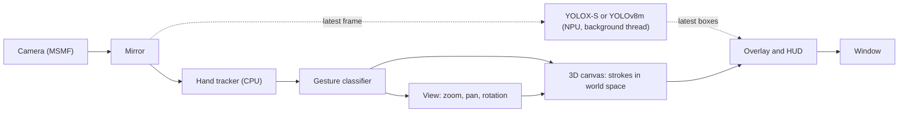

<div align="center">


# NeoDraw

**3D air drawing and real-time object detection, accelerated by the AMD Ryzen AI NPU.**


[Overview](#overview) · [Quick start](#quick-start) · [Gestures](#gestures) · [Configuration](#configuration) · [Architecture](#architecture) · [Troubleshooting](#troubleshooting)

</div>

---

## Table of contents

- [Overview](#overview)
- [Features](#features)
- [Performance](#performance)
- [Gestures](#gestures)
- [Requirements](#requirements)
- [Quick start](#quick-start)
- [Usage](#usage)
- [Configuration](#configuration)
- [NPU targeting](#npu-targeting)
- [Architecture](#architecture)
- [Project layout](#project-layout)
- [Extending NeoDraw](#extending-neodraw)
- [Testing](#testing)
- [Troubleshooting](#troubleshooting)
- [FAQ](#faq)
- [Models and acknowledgements](#models-and-acknowledgements)

## Overview

NeoDraw turns a webcam into a 3D drawing space. You draw in the air with your index finger, and moving your hand toward the camera draws nearer. The drawing lives on an unbounded canvas: pinch to zoom into it and add finer detail, make a fist to move it, and rotate it to see it from any angle. At the same time, an object detector running on the NPU labels what the camera sees, on every frame.

The object detector runs on the **Neural Processing Unit (NPU)** built into Ryzen AI processors, not on the CPU or GPU. NeoDraw exists to show a complete, working path to that NPU: the right provider options, a persistent compile cache, and a way to confirm that inference is really running on the NPU.

## Features

- **NPU inference on every frame.** Quantized (XINT8) YOLOX-S runs through ONNX Runtime's `VitisAIExecutionProvider` in about 25 ms, faster than the camera delivers frames. YOLOv8m is available for higher accuracy.
- **3D drawing.** Strokes are stored as 3D points. Hand distance from the camera sets depth, and drawing on a rotated view adds strokes along that view.
- **Unbounded canvas.** Zoom from 0.25x to 8x around the pinch point, pan with a fist, and rotate the drawing in 3D. Detail drawn while zoomed in stays small when you zoom out.
- **Non-blocking detection.** Detection runs on a background thread, so the display never waits for the NPU.
- **Rotation-tolerant gestures.** Finger state is measured relative to the wrist, so gestures work at any hand angle.
- **Smooth redraws.** Moving views redraw with fast lines grouped by colour and width; once the view settles, one anti-aliased pass restores full quality.
- **Undo.** The last 20 strokes, erases or clears can be undone.
- **Snapshots and recording.** Save the view as PNG or record it as MP4 on background threads, so capture never slows the view.
- **Detection toggle.** Turn object detection off to leave the NPU idle while you draw.
- **Fast restarts.** The compiled NPU model is cached on disk; only the first start pays the compile cost.
- **One-step setup.** `setup.ps1` builds the environment, downloads the models and verifies the hardware.
- **Plain configuration.** One optional TOML file controls the camera, detector, thresholds, depth and NPU target.

## Performance

Measured on a Ryzen 7 7840HS (Phoenix NPU) with a 1280x720 camera:

| Stage | Device | Result |
| :--- | :--- | :--- |
| YOLOX-S detection (default) | NPU | about 25 ms per frame, 30 or more detections per second |
| YOLOv8m detection (optional) | NPU | about 57 ms per frame, 13 to 17 detections per second |
| Hand tracking | CPU | about 15 ms per frame |
| Canvas overlay, view still | CPU | under 0.2 ms per frame |
| Canvas redraw, view moving (300 strokes) | CPU | about 15 ms per frame |
| Display loop | CPU | about 30 frames per second, the camera's limit |
| First start (model compile) | NPU toolchain | up to a minute, once per model |
| Later starts (cached) | | a couple of seconds |

All but 3 layers of each model run on the NPU with the default settings. With YOLOX-S every camera frame is detected, and the display loop is limited by the camera, which delivers at most 30 frames per second.

## Gestures

| Hand shape | Action | Behaviour |
| :--- | :--- | :--- |
| Index finger, thumb tucked | Draw | Draws at the index fingertip. Move your hand toward the camera to draw nearer. |
| Index + middle | Next colour | Changes once each time the gesture is made |
| Index + middle + ring | Next brush width | Cycles 4, 8, 14, 22 and 32 px, once per gesture |
| All five fingers open | Erase | Erases strokes within a circle around the palm |
| Thumb + index | Zoom | Spread to zoom in, pinch to zoom out, around the point between your fingers |
| Fist | Move | Drags the canvas with your hand |
| Pinky up (thumb optional) | Rotate | Moving your hand turns the drawing in 3D |

Keyboard shortcuts:

| Key | Action |
| :--- | :--- |
| <kbd>U</kbd> | Undo the last stroke, erase or clear |
| <kbd>C</kbd> | Clear the drawing |
| <kbd>Z</kbd> | Reset the view: zoom, position and rotation |
| <kbd>O</kbd> | Orbit: spin the drawing continuously to show its depth |
| Arrow keys | Rotate the drawing in small steps |
| <kbd>+</kbd> and <kbd>-</kbd> | Zoom in and out around the centre |
| <kbd>S</kbd> | Save a snapshot to `captures/` |
| <kbd>R</kbd> | Start or stop recording to `captures/` |
| <kbd>D</kbd> | Turn object detection on or off |
| <kbd>Q</kbd> or <kbd>Esc</kbd> | Quit |

> [!TIP]
> Drawing needs the thumb tucked in. A pointing index finger with the thumb out is read as zoom.

### Drawing in 3D

- **Depth.** NeoDraw estimates hand distance from the size of your palm in the image. Your usual distance is learned while you are not drawing; bringing the hand closer than that draws nearer, pulling it back draws further away. `depth_gain` controls the strength, and `0` gives flat drawing.
- **Seeing depth.** Near strokes appear slightly larger. Rotate with the pinky gesture, the arrow keys or orbit mode (<kbd>O</kbd>) to see the drawing from the side. The axis marker in the bottom-right corner shows the current orientation.
- **Drawing on a rotated view.** New strokes are placed relative to the current view, so you can rotate the drawing and add strokes on another side.
- **Zooming for detail.** Zoom keeps the point between your fingers fixed. Brush width is set in screen pixels at the time you draw, so detail added at 4x zoom is a quarter of the size at 1x.

## Requirements

| Requirement | Details |
| :--- | :--- |
| Operating system | Windows 11 |
| Processor | Ryzen AI processor with an NPU. Tested on Phoenix (Ryzen 7040 series) only. |
| NPU driver | Installed and visible to `xrt-smi examine` |
| Ryzen AI Software | [Version 1.7.0](https://ryzenai.docs.amd.com/en/latest/inst.html). Not redistributed in this repository. |
| Tooling | [uv](https://docs.astral.sh/uv/) and PowerShell 7.4 or newer |
| Camera | Any camera available through Media Foundation |

Confirm the NPU is present before you start:

```powershell
xrt-smi examine
```

The device table should list your NPU, for example `NPU Phoenix`.

## Quick start

```powershell
git clone https://github.com/SilentDemonSD/NeoDraw
cd NeoDraw
.\setup.ps1
.\run.bat
```

`setup.ps1` locates the SDK through the `RYZEN_AI_INSTALLATION_PATH` environment variable, which the AMD installer sets. To point it somewhere else:

```powershell
.\setup.ps1 -Sdk "C:\Program Files\RyzenAI\1.7.0"
```

<details>
<summary><strong>What the setup script does</strong></summary>

1. Creates a Python 3.12 virtual environment in `.venv`.
2. Installs AMD's `onnxruntime-vitisai` and `voe` wheels from the SDK, plus `requirements.txt`.
3. Installs MediaPipe without its `opencv-contrib-python` dependency, which conflicts with the pinned OpenCV build.
4. Copies the Vitis AI provider DLLs into `onnxruntime\capi`. uv leaves them in the wheel's data folder, and the NPU session crashes without them.
5. Downloads the configured detector and the hand model into `models/`.
6. Records the SDK path in `neodraw.toml`.
7. Runs the interaction tests and the hardware check.

</details>

> [!NOTE]
> The first run compiles the model for the NPU and can take up to a minute. The result is cached in `cache/`, so later starts take a couple of seconds.

## Usage

| Command | Purpose |
| :--- | :--- |
| `.\run.bat` | Start the application |
| `.\run.bat --camera "HP True"` | Start with a camera chosen by part of its name |
| `.\run.bat check` | Verify the NPU, camera and hand tracker, and print timings |
| `.\run.bat fetch` | Download any missing models |

A successful check looks like this:

```text
camera: HP True Vision FHD Camera (index 1)
check ok: sample=['car', 'truck'], camera=(720, 1280, 3), YOLOX-S 24.7 ms/frame on VitisAIExecutionProvider, hands 16.5 ms/frame
```

The bar at the top of the window shows the detection rate and latency, the display frame rate, the zoom level and rotation, the current mode, the brush width, the drawing depth, and the active colour. The bar at the bottom lists the keys and confirms actions such as a saved snapshot. A red REC marker shows while recording.

Snapshots and recordings are saved to `captures/` with a timestamped name. They contain the camera view, boxes and drawing, without the status bars.

## Configuration

Configuration is optional. Copy `neodraw.example.toml` to `neodraw.toml` and change what you need. The file is ignored by git, so machine-specific values stay local.

```toml
camera = "HP True Vision"
detector = "yolov8m"
depth_gain = 2.0
```

| Key | Default | Meaning |
| :--- | :--- | :--- |
| `camera` | `""` | Part of the camera name. Empty selects the first camera. |
| `width`, `height` | `1280`, `720` | Capture size |
| `sdk` | `RYZEN_AI_INSTALLATION_PATH` | Ryzen AI SDK folder |
| `detector` | `yolox-s` | `yolox-s` for speed or `yolov8m` for accuracy. Run `.\run.bat fetch` after switching. |
| `npu_target` | `RyzenAI_vision_config_2` | Target name from the SDK's `vaip_config.json` |
| `npu_overlay` | `phoenix/4x4.xclbin` | NPU overlay, relative to `voe-4.0-win_amd64\xclbins` |
| `score` | `0.45` | Minimum detection confidence |
| `iou` | `0.5` | Overlap threshold for non-maximum suppression |
| `max_zoom` | `8.0` | Canvas zoom limit (the minimum is 0.25x) |
| `depth_gain` | `1.5` | How strongly hand distance moves strokes in depth. `0` draws flat. |
| `eraser_radius` | `60` | Eraser radius in pixels |
| `hold_frames` | `3` | Frames a gesture must hold before it takes effect |

An unknown key stops the application with a message naming it, so typing mistakes do not pass silently.

## NPU targeting

> [!IMPORTANT]
> The Vitis AI provider falls back to the CPU without an error when the target does not match the chip, and still reports `VitisAIExecutionProvider`. A provider name alone does not prove the NPU is in use.

On Phoenix, the two options behave very differently:

| Provider options | Result on Phoenix |
| :--- | :--- |
| `target: RyzenAI_vision_config_2` with `phoenix/4x4.xclbin` | All but 3 layers run on the NPU |
| `target: X1` (the documented default) | 264 layers fall back to the CPU |

To confirm the NPU is doing the work:

1. Run `.\run.bat check` and compare the detection time with the [performance table](#performance). A CPU fallback is several times slower.
2. Open Task Manager, select **Performance**, and watch the NPU graph while the application runs.

> [!WARNING]
> Newer processors (Strix, Krackan) need a different target and overlay. Those are untested here; set `npu_target` and `npu_overlay` for your chip and verify with the steps above.

## Architecture

Each frame goes through one loop. Detection is the only stage that leaves the main thread.



- **Background detection.** `BackgroundDetector` holds a single worker thread and submits a new frame as soon as the previous one finishes. YOLOX-S keeps up with the camera, so in practice every frame is detected.
- **World-space strokes.** `AirCanvas` stores each stroke as an array of 3D points with a colour and a world-space width. `View` projects them to the screen with rotation, zoom, pan and a mild perspective, and maps the fingertip back into the world when you draw.
- **Cached rendering.** The canvas keeps a rendered layer and a mask. When nothing changes, drawing it costs one masked copy. New stroke segments are drawn straight into the layer; a full redraw happens only when the view or the strokes change.
- **Gesture settling.** A gesture must hold for `hold_frames` frames before the mode changes. This removes flicker between shapes and makes colour and width change exactly once per gesture.
- **Compile cache.** `NpuRuntime` gives every model a cache key and keeps the compiled result on disk.

## Project layout

```text
NeoDraw/
├── neodraw/
│   ├── __main__.py     Command-line entry point: run, check, fetch
│   ├── config.py       Settings, loaded from neodraw.toml
│   ├── assets.py       Model downloads
│   ├── runtime.py      NPU session factory: provider options and compile cache
│   ├── detector.py     YOLOX-S and YOLOv8m pre- and post-processing, background detection
│   ├── gestures.py     Hand shape to gesture (pure logic, no dependencies)
│   ├── hands.py        MediaPipe hand tracker
│   ├── canvas.py       3D view and world-space canvas: draw, erase, zoom, pan, rotate, undo
│   ├── captures.py     Snapshots and background video recording
│   ├── camera.py       Camera selection by name
│   ├── app.py          Main loop and overlay
│   └── check.py        Hardware check
├── tests/              Hardware-free tests
├── docs/               Banner and documentation assets
├── setup.ps1           One-step install
├── run.bat             Launcher
├── requirements.txt
└── neodraw.example.toml
```

These folders are created locally and ignored by git: `.venv/`, `models/`, `samples/`, `cache/`, `captures/` and `sdk/`.

## Extending NeoDraw

**Add another NPU detector.** Subclass `YoloDetector` in `neodraw/detector.py`, set its model files and implement `_tensor` and `_decode`, then register it in `DETECTORS`. The session, letterbox, NMS, background thread and model download are shared.

```python
class MyDetector(YoloDetector):
    NAME, KEY, MODEL = "My model", "my-model", "my-model.onnx"
    FILES = ("my-model.onnx",)

    def _tensor(self):
        ...

    def _decode(self, pred):
        ...
```

**Add a gesture.** Map the finger pattern in `neodraw/gestures.py`, handle the new mode in `neodraw/canvas.py` or `neodraw/app.py`, and add a case to `tests/test_interaction.py`.

## Testing

The interaction tests need no camera and no NPU. They cover the gesture classifier, the 3D view round trip, zoom around a point, drawing with depth, erasing, panning, rotation, undo, overlay compositing, snapshots and video recording.

```powershell
.venv\Scripts\python.exe -m tests.test_interaction
```

The hardware check covers the rest: NPU detection on a sample image, a camera frame, and timings for both models.

```powershell
.\run.bat check
```

## Troubleshooting

| Symptom | Cause and fix |
| :--- | :--- |
| `NPU overlay not found` | The SDK path is wrong. Set `sdk` in `neodraw.toml` or re-run `.\setup.ps1 -Sdk <path>`. |
| `VitisAIExecutionProvider is not available` | The AMD wheels are not installed in `.venv`. Run `.\setup.ps1`. |
| Access violation when the session is created | The provider DLLs are missing from `onnxruntime\capi`. Run `.\setup.ps1`, which copies them. |
| `onnxruntime` fails to import | NumPy 2 is installed. The AMD build needs `numpy<2`; reinstall from `requirements.txt`. |
| Detection is slow (several times the table above) | CPU fallback. See [NPU targeting](#npu-targeting). |
| The wrong camera opens | Set `camera` in `neodraw.toml` or pass `--camera`. An unmatched name lists the available cameras. |
| Strokes jump in depth | Palm-size depth is noisy for some hand poses. Lower `depth_gain`, or set it to `0` for flat drawing. |
| The drawing is off screen | Press <kbd>Z</kbd> to reset the view. |
| Every start takes a minute | The compile cache is not being written. Check that `cache/` is writable. |
| `W0000` and `INFO` lines at start | Normal MediaPipe start-up messages. They are harmless. |

## FAQ

<details>
<summary><strong>Why not Mojo? Would it make NeoDraw faster?</strong></summary>

No, for two reasons.

1. **It cannot run here.** Mojo has no native Windows build (WSL only), and Modular's MAX runtime targets CPUs and GPUs, not the AMD XDNA NPU. The only supported route to this NPU is AMD's Vitis AI execution provider, driven from Python or C++.
2. **Python is not the bottleneck.** A per-stage profile of the frame loop shows where the time goes:

| Stage | Time per frame | Runs in |
| :--- | :--- | :--- |
| YOLOX-S detection | about 25 ms, off the main thread | NPU |
| Hand tracking | about 15 ms | MediaPipe (C++) |
| Camera read | about 4 ms | Media Foundation |
| Drawing overlay | about 0.06 ms | OpenCV (C++) |
| Everything else | under 1 ms | Python |

The loop already reaches the camera's limit of about 30 frames per second. The real hotspots the profiles found were all fixed in place: the drawing overlay (17.8 ms to 0.06 ms with `cv2.copyTo`), the 3D redraw (142 ms to 15 ms by grouping strokes and drawing fast lines while the view moves), and detection itself (57 ms to 25 ms with YOLOX-S). Rewriting the remaining Python in Mojo would save less than a millisecond per frame.

</details>

<details>
<summary><strong>Why does hand tracking run on the CPU?</strong></summary>

The MediaPipe hand model runs in about 17 ms on the CPU, which is fast enough for the display loop. Keeping it off the NPU leaves the NPU free for the object detector.

</details>

<details>
<summary><strong>Which detector should I use?</strong></summary>

`yolox-s`, the default, detects every camera frame in about 25 ms. `yolov8m` is more accurate on small and distant objects but takes about 57 ms, so it detects about every second frame. Both find the same objects in the sample check.

</details>

<details>
<summary><strong>Does it work on Linux or on Intel and Qualcomm NPUs?</strong></summary>

No. NeoDraw uses AMD's Windows Ryzen AI stack and Media Foundation for the camera.

</details>

## Models and acknowledgements

Models are downloaded at setup and are not stored in this repository:

| Model | Source | Runs on |
| :--- | :--- | :--- |
| YOLOX-S, quantized for Ryzen AI (default) | [amd/yolox-s](https://huggingface.co/amd/yolox-s) | NPU |
| YOLOv8m, quantized for Ryzen AI (optional) | [amd/yolov8m](https://huggingface.co/amd/yolov8m) | NPU |
| Hand Landmarker | [MediaPipe](https://ai.google.dev/edge/mediapipe/solutions/vision/hand_landmarker) | CPU |

Built on [Ryzen AI Software](https://ryzenai.docs.amd.com/), [ONNX Runtime](https://onnxruntime.ai/), [MediaPipe](https://ai.google.dev/edge/mediapipe) and [OpenCV](https://opencv.org/).

> [!NOTE]
> Each model carries its own licence. Check it before using the model in your own project.

<div align="center">

[Back to top](#neodraw)

</div>
