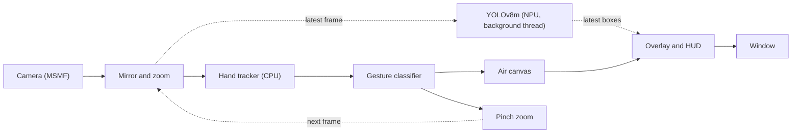

<div align="center">


# NeoDraw

**Air drawing and real-time object detection, accelerated by the AMD Ryzen AI NPU.**


[Overview](#overview) · [Quick start](#quick-start) · [Gestures](#gestures) · [Configuration](#configuration) · [Architecture](#architecture) · [Troubleshooting](#troubleshooting)

</div>

---

## Table of contents

- [Overview](#overview)
- [Features](#features)
- [Performance](#performance)
- [Gestures](#gestures)
- [Requirements](#requirements)
- [Quick start](#quick-start)
- [Usage](#usage)
- [Configuration](#configuration)
- [NPU targeting](#npu-targeting)
- [Architecture](#architecture)
- [Project layout](#project-layout)
- [Extending NeoDraw](#extending-neodraw)
- [Testing](#testing)
- [Troubleshooting](#troubleshooting)
- [FAQ](#faq)
- [Models and acknowledgements](#models-and-acknowledgements)

## Overview

NeoDraw turns a webcam into a drawing surface. You draw in the air with your index finger, change colour and brush width with hand shapes, erase with an open palm and zoom with a pinch. At the same time, a YOLOv8m object detector labels what the camera sees.

The object detector runs on the **Neural Processing Unit (NPU)** built into Ryzen AI processors, not on the CPU or GPU. NeoDraw exists to show a complete, working path to that NPU: the right provider options, a persistent compile cache, and a way to confirm that inference is really running on the NPU.

## Features

- **NPU inference.** Quantized (XINT8) YOLOv8m runs through ONNX Runtime's `VitisAIExecutionProvider`.
- **Non-blocking detection.** Detection runs on a background thread, so the display never waits for the NPU.
- **Hand gestures.** MediaPipe hand tracking drives drawing, erasing, colour, brush width and zoom.
- **Rotation-tolerant gestures.** Finger state is measured relative to the wrist, so gestures work at any hand angle.
- **Fast restarts.** The compiled NPU model is cached on disk; only the first start pays the compile cost.
- **One-step setup.** `setup.ps1` builds the environment, downloads the models and verifies the hardware.
- **Plain configuration.** One optional TOML file controls the camera, thresholds and NPU target.

## Performance

Measured on a Ryzen 7 7840HS (Phoenix NPU) with a 1280x720 camera:

| Stage | Device | Result |
| :--- | :--- | :--- |
| YOLOv8m detection | NPU | about 60 ms per frame (12 to 14 detections per second) |
| Hand tracking | CPU | about 17 ms per frame |
| Display loop | CPU | about 25 frames per second |
| First start (model compile) | NPU toolchain | up to a minute, once |
| Later starts (cached) | | a couple of seconds |

All but 3 layers of the model run on the NPU with the default settings.

## Gestures

| Hand shape | Action | Behaviour |
| :--- | :--- | :--- |
| Index finger, thumb tucked | Draw | Draws at the index fingertip |
| Index + middle | Next colour | Changes once each time the gesture is made |
| Index + middle + ring | Next brush width | Cycles 4, 8, 14, 22 and 32 px, once per gesture |
| All five fingers open | Erase | Erases a circle centred on the palm |
| Thumb + index | Zoom | Spread to zoom in, pinch to zoom out, from 1x to 4x |

Keyboard shortcuts:

| Key | Action |
| :--- | :--- |
| <kbd>C</kbd> | Clear the drawing |
| <kbd>Z</kbd> | Reset zoom |
| <kbd>Q</kbd> or <kbd>Esc</kbd> | Quit |

> [!TIP]
> Drawing needs the thumb tucked in. A pointing index finger with the thumb out is read as zoom.

Zoom is relative to the finger gap at the moment the gesture starts, so you can zoom in, release, and pinch again to go further. It crops the camera image; the drawing stays where it is on screen.

## Requirements

| Requirement | Details |
| :--- | :--- |
| Operating system | Windows 11 |
| Processor | Ryzen AI processor with an NPU. Tested on Phoenix (Ryzen 7040 series) only. |
| NPU driver | Installed and visible to `xrt-smi examine` |
| Ryzen AI Software | [Version 1.7.0](https://ryzenai.docs.amd.com/en/latest/inst.html). Not redistributed in this repository. |
| Tooling | [uv](https://docs.astral.sh/uv/) and PowerShell 7.4 or newer |
| Camera | Any camera available through Media Foundation |

Confirm the NPU is present before you start:

```powershell
xrt-smi examine
```

The device table should list your NPU, for example `NPU Phoenix`.

## Quick start

```powershell
git clone https://github.com/SilentDemonSD/NeoDraw
cd NeoDraw
.\setup.ps1
.\run.bat
```

`setup.ps1` locates the SDK through the `RYZEN_AI_INSTALLATION_PATH` environment variable, which the AMD installer sets. To point it somewhere else:

```powershell
.\setup.ps1 -Sdk "C:\Program Files\RyzenAI\1.7.0"
```

<details>
<summary><strong>What the setup script does</strong></summary>

1. Creates a Python 3.12 virtual environment in `.venv`.
2. Installs AMD's `onnxruntime-vitisai` and `voe` wheels from the SDK, plus `requirements.txt`.
3. Installs MediaPipe without its `opencv-contrib-python` dependency, which conflicts with the pinned OpenCV build.
4. Copies the Vitis AI provider DLLs into `onnxruntime\capi`. uv leaves them in the wheel's data folder, and the NPU session crashes without them.
5. Downloads the models (about 110 MB) into `models/`.
6. Records the SDK path in `neodraw.toml`.
7. Runs the interaction tests and the hardware check.

</details>

> [!NOTE]
> The first run compiles the model for the NPU and can take up to a minute. The result is cached in `cache/`, so later starts take a couple of seconds.

## Usage

| Command | Purpose |
| :--- | :--- |
| `.\run.bat` | Start the application |
| `.\run.bat --camera "HP True"` | Start with a camera chosen by part of its name |
| `.\run.bat check` | Verify the NPU, camera and hand tracker, and print timings |
| `.\run.bat fetch` | Download any missing models |

A successful check looks like this:

```text
camera: HP True Vision FHD Camera (index 1)
check ok: sample=['car', 'truck'], camera=(720, 1280, 3), YOLOv8m 59.2 ms/frame on VitisAIExecutionProvider, hands 19.2 ms/frame
```

The bar at the top of the window shows the detection rate and latency, the display frame rate, the zoom level, the current mode, and the active colour and brush width.

## Configuration

Configuration is optional. Copy `neodraw.example.toml` to `neodraw.toml` and change what you need. The file is ignored by git, so machine-specific values stay local.

```toml
camera = "HP True Vision"
score = 0.45
max_zoom = 4.0
```

| Key | Default | Meaning |
| :--- | :--- | :--- |
| `camera` | `""` | Part of the camera name. Empty selects the first camera. |
| `width`, `height` | `1280`, `720` | Capture size |
| `sdk` | `RYZEN_AI_INSTALLATION_PATH` | Ryzen AI SDK folder |
| `npu_target` | `RyzenAI_vision_config_2` | Target name from the SDK's `vaip_config.json` |
| `npu_overlay` | `phoenix/4x4.xclbin` | NPU overlay, relative to `voe-4.0-win_amd64\xclbins` |
| `score` | `0.45` | Minimum detection confidence |
| `iou` | `0.5` | Overlap threshold for non-maximum suppression |
| `max_zoom` | `4.0` | Zoom limit |
| `eraser_radius` | `60` | Eraser radius in pixels |
| `hold_frames` | `3` | Frames a gesture must hold before it takes effect |

An unknown key stops the application with a message naming it, so typing mistakes do not pass silently.

## NPU targeting

> [!IMPORTANT]
> The Vitis AI provider falls back to the CPU without an error when the target does not match the chip, and still reports `VitisAIExecutionProvider`. A provider name alone does not prove the NPU is in use.

On Phoenix, the two options behave very differently:

| Provider options | Result on Phoenix |
| :--- | :--- |
| `target: RyzenAI_vision_config_2` with `phoenix/4x4.xclbin` | All but 3 layers run on the NPU |
| `target: X1` (the documented default) | 264 layers fall back to the CPU |

To confirm the NPU is doing the work:

1. Run `.\run.bat check` and compare the YOLOv8m time with the [performance table](#performance). A CPU fallback is several times slower.
2. Open Task Manager, select **Performance**, and watch the NPU graph while the application runs.

> [!WARNING]
> Newer processors (Strix, Krackan) need a different target and overlay. Those are untested here; set `npu_target` and `npu_overlay` for your chip and verify with the steps above.

## Architecture

Each frame goes through one loop. Detection is the only stage that leaves the main thread.



- **Background detection.** `BackgroundDetector` holds a single worker thread. It submits a new frame only when the previous one has finished, so the NPU is always busy and the display never blocks on it.
- **Gesture settling.** A gesture must hold for `hold_frames` frames before the mode changes. This removes flicker between shapes and makes colour and width change exactly once per gesture.
- **Compile cache.** `NpuRuntime` gives every model a cache key and keeps the compiled result on disk.

## Project layout

```text
NeoDraw/
├── neodraw/
│   ├── __main__.py     Command-line entry point: run, check, fetch
│   ├── config.py       Settings, loaded from neodraw.toml
│   ├── assets.py       Model downloads
│   ├── runtime.py      NPU session factory: provider options and compile cache
│   ├── detector.py     YOLOv8m pre- and post-processing, background detection
│   ├── gestures.py     Hand shape to gesture (pure logic, no dependencies)
│   ├── hands.py        MediaPipe hand tracker
│   ├── canvas.py       Drawing, erasing, colour and brush width
│   ├── zoom.py         Pinch zoom
│   ├── camera.py       Camera selection by name
│   ├── app.py          Main loop and overlay
│   └── check.py        Hardware check
├── tests/              Hardware-free tests
├── docs/               Banner and documentation assets
├── setup.ps1           One-step install
├── run.bat             Launcher
├── requirements.txt
└── neodraw.example.toml
```

These folders are created locally and ignored by git: `.venv/`, `models/`, `samples/`, `cache/` and `sdk/`.

## Extending NeoDraw

**Add another NPU model.** Build its session through the runtime and give the class a `detect(frame)` method. `BackgroundDetector` runs anything with that shape.

```python
class MyDetector:
    def __init__(self, runtime, settings):
        self.session = runtime.session(settings.root / "models" / "my_model.onnx", "my_model_phoenix")

    def detect(self, frame):
        ...
```

**Add a gesture.** Map the finger pattern in `neodraw/gestures.py`, handle the new mode in `neodraw/canvas.py` or `neodraw/app.py`, and add a case to `tests/test_interaction.py`.

## Testing

The interaction tests need no camera and no NPU. They run the gesture classifier, the canvas and the zoom on synthetic hands.

```powershell
.venv\Scripts\python.exe -m tests.test_interaction
```

The hardware check covers the rest: NPU detection on a sample image, a camera frame, and timings for both models.

```powershell
.\run.bat check
```

## Troubleshooting

| Symptom | Cause and fix |
| :--- | :--- |
| `NPU overlay not found` | The SDK path is wrong. Set `sdk` in `neodraw.toml` or re-run `.\setup.ps1 -Sdk <path>`. |
| `VitisAIExecutionProvider is not available` | The AMD wheels are not installed in `.venv`. Run `.\setup.ps1`. |
| Access violation when the session is created | The provider DLLs are missing from `onnxruntime\capi`. Run `.\setup.ps1`, which copies them. |
| `onnxruntime` fails to import | NumPy 2 is installed. The AMD build needs `numpy<2`; reinstall from `requirements.txt`. |
| Detection is slow (several times the table above) | CPU fallback. See [NPU targeting](#npu-targeting). |
| The wrong camera opens | Set `camera` in `neodraw.toml` or pass `--camera`. An unmatched name lists the available cameras. |
| Every start takes a minute | The compile cache is not being written. Check that `cache/` is writable. |
| `W0000` and `INFO` lines at start | Normal MediaPipe start-up messages. They are harmless. |

## FAQ

<details>
<summary><strong>Why not Mojo?</strong></summary>

Mojo has no native Windows build (WSL only), and Modular's MAX runtime targets CPUs and GPUs, not the AMD XDNA NPU. The only supported route to this NPU is AMD's Vitis AI execution provider, which is driven from Python or C++. The heavy work already runs in native code (the NPU, OpenCV and MediaPipe), so Python is not the bottleneck.

</details>

<details>
<summary><strong>Why does hand tracking run on the CPU?</strong></summary>

The MediaPipe hand model runs in about 17 ms on the CPU, which is fast enough for the display loop. Keeping it off the NPU leaves the NPU free for the much heavier YOLOv8m model.

</details>

<details>
<summary><strong>Why is the detection rate lower than the display rate?</strong></summary>

By design. Detection takes about 60 ms, so it runs on its own thread at its own pace while the display continues at camera speed. Boxes are drawn from the most recent finished detection.

</details>

<details>
<summary><strong>Does it work on Linux or on Intel and Qualcomm NPUs?</strong></summary>

No. NeoDraw uses AMD's Windows Ryzen AI stack and Media Foundation for the camera.

</details>

## Models and acknowledgements

Models are downloaded at setup and are not stored in this repository:

| Model | Source | Runs on |
| :--- | :--- | :--- |
| YOLOv8m, quantized for Ryzen AI | [amd/yolov8m](https://huggingface.co/amd/yolov8m) | NPU |
| Hand Landmarker | [MediaPipe](https://ai.google.dev/edge/mediapipe/solutions/vision/hand_landmarker) | CPU |

Built on [Ryzen AI Software](https://ryzenai.docs.amd.com/), [ONNX Runtime](https://onnxruntime.ai/), [MediaPipe](https://ai.google.dev/edge/mediapipe) and [OpenCV](https://opencv.org/).

> [!NOTE]
> Each model carries its own licence. Check it before using the model in your own project.

<div align="center">

[Back to top](#neodraw)

</div>
